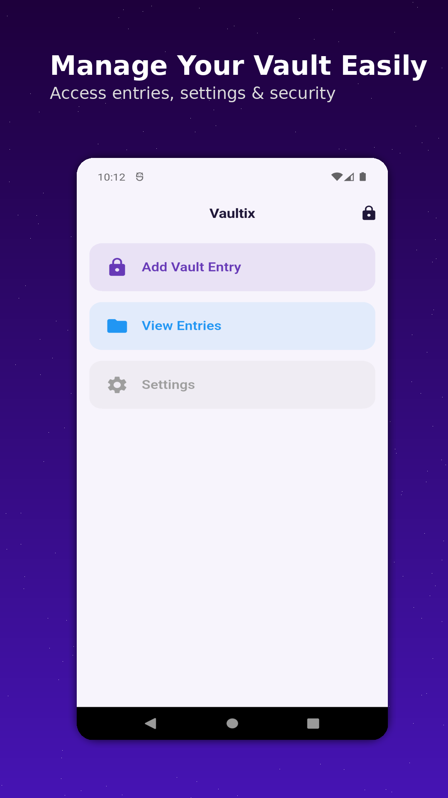
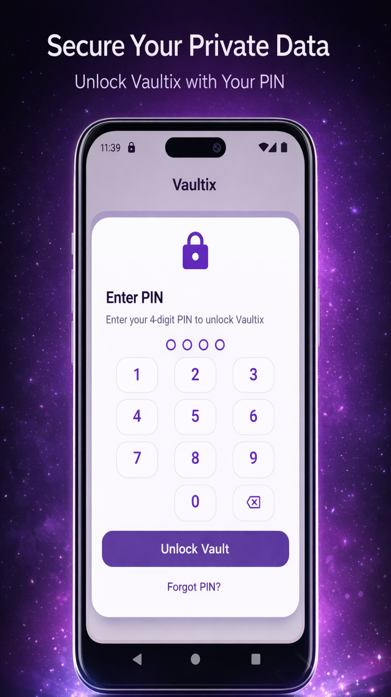
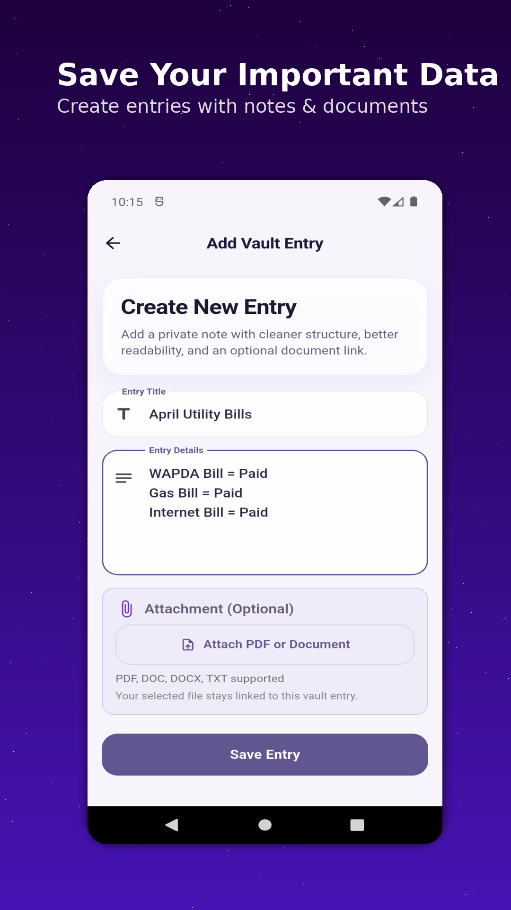
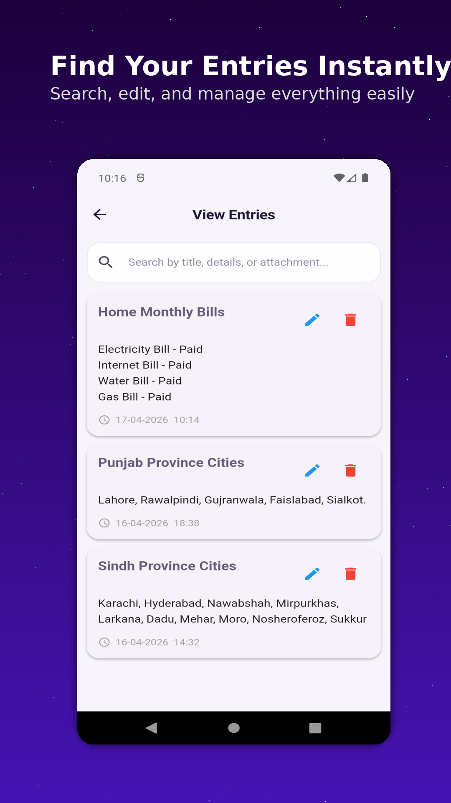
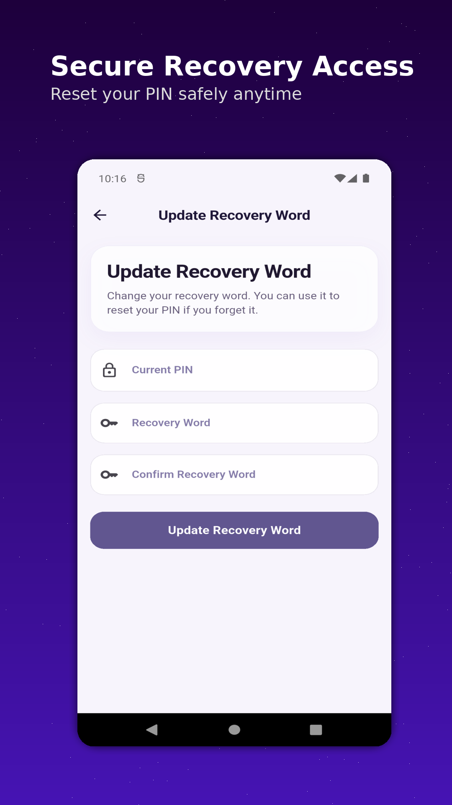
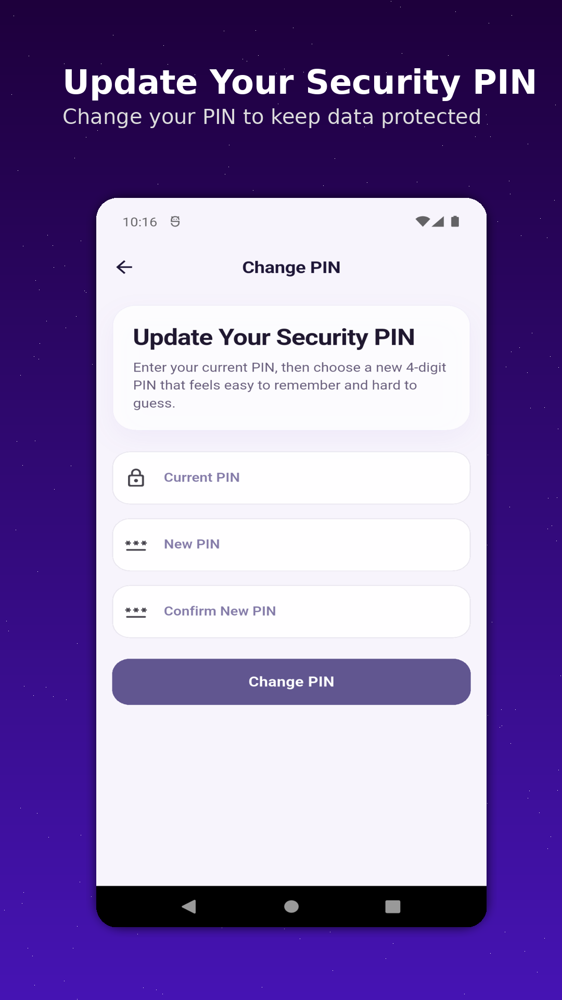

# Vaultix

Vaultix is a lightweight offline privacy-focused personal vault app built with Flutter.

Designed for users who want a simple and secure way to store personal information directly on their device without cloud storage or online accounts.

---

## Features

- Offline-first architecture
- PIN lock protection
- Custom keypad security
- Auto-lock on inactivity
- App minimize protection
- Wrong PIN protection
- Recovery word system
- Add, edit, delete entries
- Search functionality
- Clean and minimal UI

---

## Privacy Focus

Vaultix does not use:
- Cloud storage
- External servers
- Online accounts
- User tracking

All data remains stored locally on the user's device.

---

## Tech Stack

- Flutter
- Dart
- Hive Local Database

---

## Status

Currently in active development and testing.

---

## Screenshots

### Home Screen

### PIN Lock

### Add Entry

### View Entries

### Recovery Screen

### Change PIN

---

## Developer

AI Genius Partners
